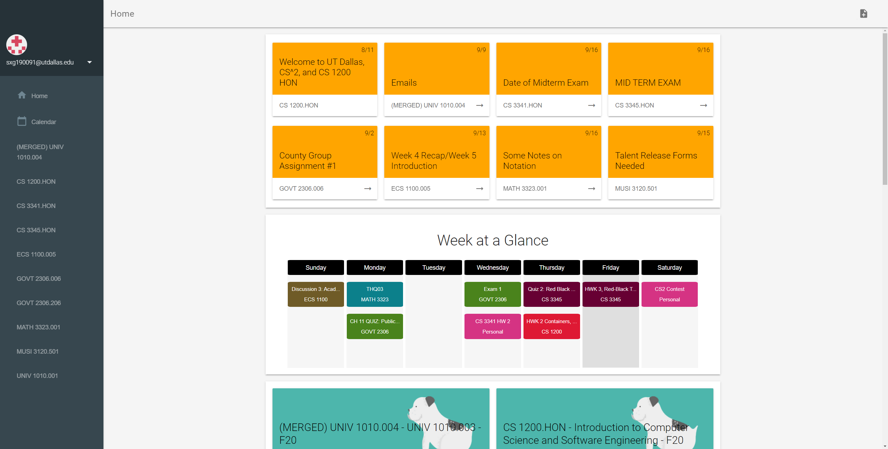

# Whiteboard

### Two main goals of this project:
1. Improve the UI of Blackboard
2. Add non-intrusive features that speed up workflow

### Features:
+ UI Features
	- Material UI (with [Material Design Lite](https://getmdl.io/))
	- Week at a Glance
	- Course/Group Cards
	- Sidebar Courses
	- Calendar
	- Announcement cards
	- Iframe fallback
+ Logic Features
	- Add-to-Calendar popup
	- Pin course content
	- Add grade percentage

### Planned:
+ Global pins
+ Tree-style sidebar

## Screenshots

