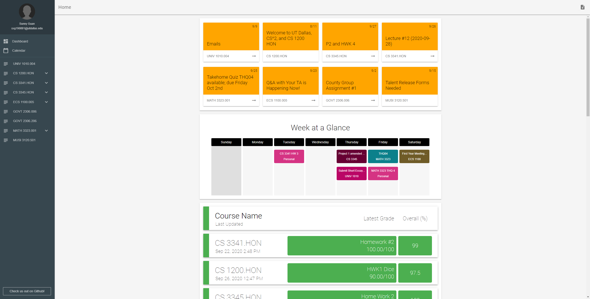

# Whiteboard

### Links:

1. [Chrome Webstore Link](https://chrome.google.com/webstore/detail/whiteboard/hgoiijmhpdjkmecnlkpdcflgfjebpbhe?hl=en&authuser=1) (stable version)
2. [Behind-the-Scenes](MOREINFO.md)

### Two main goals of this project:
1. Improve the UI of Blackboard
2. Add non-intrusive features that speed up workflow

## Features:
+ UI Features
	- Material UI (with [Material Design Lite](https://getmdl.io/))
	- Week at a Glance
	- Course/Group Cards
	- Sidebar Courses
	- Calendar
	- Announcement cards
	- Iframe fallback
+ Logic Features
	- Add-to-Calendar popup
	- Pin course content
	- Add grade percentage
	- Grades overview
	- Notifications
	- Advance sidebar

## Installing Whiteboard (beta versions)
1. Download the [zipped source](https://github.com/sunnyguan/whiteboard/raw/master/whiteboard.zip) from GitHub and extract it on your computer.  
2. Navigate to <chrome://extensions> and enable developer mode at the top right.  
  
3. Drag the whiteboard folder (the one that was just extracted) into the extensions page. You can also select the folder from the "Load unpacked" button at the top left.  
  
4. Whiteboard should now be in your extensions page. Navigate to [eLearning](https://elearning.utdallas.edu) to experience Whiteboard!  

## Updating Whiteboard (beta versions)
1. Delete the original whiteboard folder you extracted.  
2. Redownload the [zipped source](https://github.com/sunnyguan/whiteboard/raw/master/whiteboard.zip) and extract it to the same location.  
3. Navigate to <chrome://extensions> and reload the extension.  

## How to use each feature

### Dashboard (home page)
1. There are three key features located on the home page
	1. Announcements, which are the orange cards on the top grid, shows the two most recent announcements of the course. Clicking on the arrow part of the card switches between the two recent announcements. Clicking on the orange part of the card will redirect you to that class's annoucements page.
	2. Week at a Glance, which is a calendar showing you your agenda for this week. Clicking on clickable tiles (such as homework/exams) will lead to their pages.
	3. Grades overview, which shows all of your courses (where you have at least one assignment) with their most recent grade and overall grade. The most recent assignment is meant to help you quickly check if your exam/test grades have came out recently. The date listed below the course name is the last updated date for that course, which is the same as the date of the most recent assignment. Clicking on the course row will lead to that course's grades page.
2. A list of courses and groups can be found by scrolling below the grades overview.

### Sidebar and Pins
1. Contains a list of all your courses (and dashboard/calendar). Each course can be clicked to access that course's homepage.
2. Note: When the user first start using the extension, these courses will not have expandable sections with user-defined pins since none have been added.
3. To add a pin, go to any course and look for orange pin icons on the top right of each content card. Click the pin and it should appear in the sidebar.
4. To remove a pin, click the red sideways pin icon on the sidebar.
5. Sidebar logic:
	1. In the dashboard, each course will only contain its user-defined pins and not include the course's own sidebar links
	2. In each course's individual pages, the dashboard will expand to include its pins as well as the course's own links
	3. While the user is in one course, other courses will only have user pins listed on the sidebar.

### Quick Add to Calendar
1. On every page in Whiteboard, there will be an add icon on the top right of the page. Clicking on that icon will allow users to quickly add an event to their calendar. Fields include title, description, start time, and end time.
